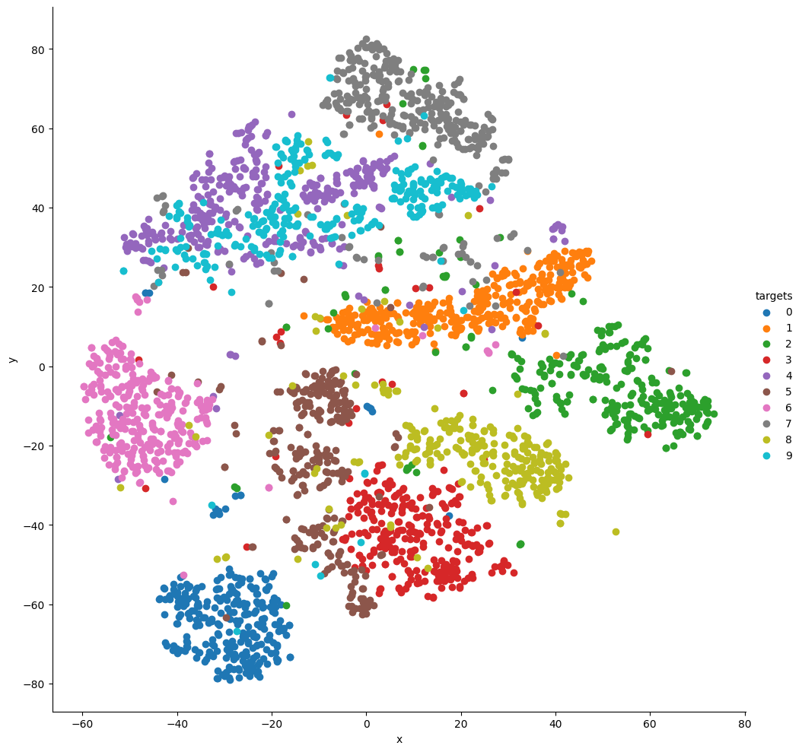

# Basic Visualization of the MNIST dataset throughout t-SNE
In this repository we are going to consider one of the most famous handwritten digits dataset, namely the MNIST dataset.

Usually this dataset is used to tackle a supervised problem, that is, given an image of and handwritten digit as input, we would like to predict what number actually is.

This dataset can easily be converted in a suitable unsupervised format for basic visualization. Indeed will apply **t-Distroibuited Stochastic Neighbour Embedding** decomposition [1] to this dataset, in such a way we can be look at each image into a bi-dimensional space.
## Repository structure
In this section is summarized the structure of this one-script-repository and the procedure you should use to run it in order to obtain a visual representation of the MNIST dataset throughout the t-SNE.

The repository has the following structure
```
 mnist-visualization
 │   README.md
 │   LICENSE    
 │   requirements.txt
 |
 └── src
 │     main.py
 │   
 │── image
 │      ...
 
```
Actually, you can delate the ```image``` folder, since it is created running the *main* script.

### Requirements
First of all you need to the ```clone``` this repository or download it from GitHub.

After that, you should crate your own Python enviroment, the one I use has been built with Python 3.8, finally you have to install the required packages using the following command
```bash 
$ pip install -r requirements.txt
```
### The main script

This one-script-repository is extremaly trivial: once you have installed the needed libraries you can move to the *src* folder and run the following command:
```bash
$ python main.py
```
Let's analyze what happen when you run the latter script.

First of all, as said before, a new folder called "image" is created and all the required libraries are imported

```python
import os
import matplotlib.pyplot as plt
import numpy as np
import pandas as pd
import seaborn as sns

if os.path.exists("../image") is False:
    os.mkdir("../image")
```

Then the dataset is imported from sklearn:
```python
import sklearn.datasets as datasets

data = datasets.fetch_openml(
        'mnist_784',
        version = 1,
        return_X_y = True
    )

pixel_values, targets = data
targets = targets.astype(int)

```
Each element of the dataset is an image consisting of 28x28 pixels, and it is possible to save for instance the first example as follows
```python
single_image = pixel_values.iloc[0].values.reshape(28,28)

plt.imsave("../image/single_image.png", single_image, cmap="gray")
```
The element is 
<p align="center">
  
</p>

Then, the t-SNE transformation is defined as
```python
tsne = manifold.TSNE(n_components=2, random_state=42)
    transformed_data = tsne.fit_transform(pixel_values.iloc[:3000])
```

 and the data are converted as pandas dataframe as follows
 ```python
 tsne_df = pd.DataFrame(
        np.column_stack((transformed_data, targets[:3000])),
        columns = ["x", "y", "targets"]
        )
    tsne_df.loc[:, "targets"] = tsne_df.targets.astype(int)
 ```

 Eventually we can visualize the results obtained by

 ```python
 grid = sns.FacetGrid(tsne_df, hue = "targets", height = 10)
    grid.map(plt.scatter, "x", "y").add_legend().savefig("../image/output.png")
 
 ```
<p align="center">
  
</p>


## References
1. [Roweis, Sam; Hinton, Geoffrey (January 2002). ***Stochastic neighbor embedding***. Neural Information Processing Systems.](https://cs.nyu.edu/~roweis/papers/sne_final.pdf)
2. [Abhishek Thakur (November 2020)](https://github.com/abhishekkrthakur/approachingalmost/blob/master/AAAMLP.pdf)